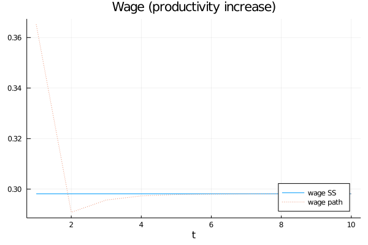
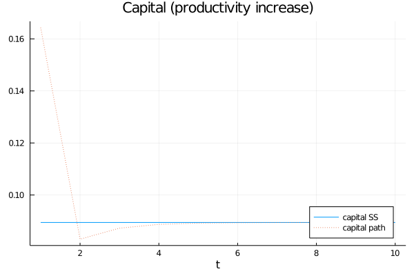
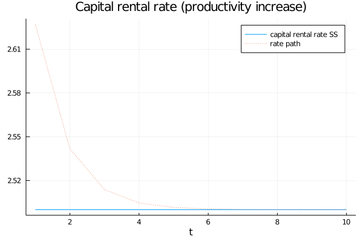
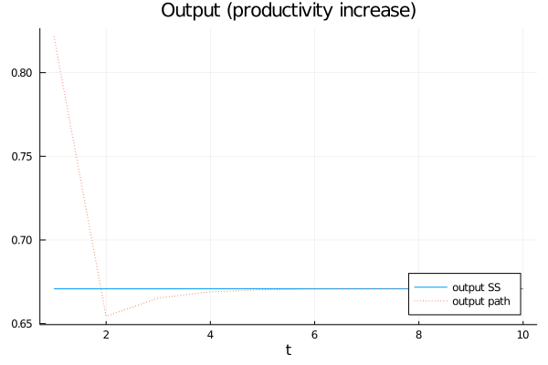
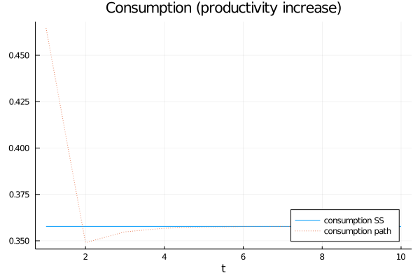

```{r setup, include=FALSE, cache=TRUE}
knitr::opts_chunk$set(echo = TRUE)
knitr::opts_chunk$set(engine.path = list(
  julia = '/Applications/Julia-1.5.app/Contents/Resources/julia/bin'
))
```
```{r julia, eval =TRUE, include=FALSE}
library(JuliaCall)
julia_home<-julia_setup(JULIA_HOME = "/Applications/Julia-1.5.app/Contents/Resources/julia/bin")
```

### Competitive equilibrium for this economy

**Definition:** A sequential markets equilibrium is a a sequence of prices $\{w_t, r_t\}^{\infty}_{t=0}$, allocations for the representative agent $\{c_t, k_{t+1}^s\}^{\infty}_{t=0}$ and allocations for the representative firm $\{l_t^d, k_{t}^d\}^{\infty}_{t=0}$ such that:

1. Given $k_0$ and $\{w_t, r_t\}^{\infty}_{t=0}$, allocations for the representative agent $\{c_t, k_{t+1}^s\}^{\infty}_{t=0}$ solves the agent's maximization problem:

$$\begin{aligned}
\max_{\{c_t, k_{t+1}\}_{t=0}^\infty} & \sum_{t=0}^{\infty}\beta^t U(c_t)\\
s.t. \; & c_t+k_{t+1}^s =  r_tk_{t}^s+w_t\\
& c_t, k_{t+1}^s\geq0 \; \forall \, t=0,1,\dots\\
& k_0 \; \text{given}
\end{aligned}$$

2. For each $t \ge 0$, given $(w_t, r_t)$ the firm allocation $(l_t^d,k_t^d)$ solves the firms' maximization problem:

$$
\max_{k_t,l_t\, \ge \, 0} \; F(k_t^d,l_t^d)-r_tk_t^d-w_tl_t^d
$$

3. Markets clear, for all $t \ge 0$

$$\begin{aligned}
l_t^d &= 1 \\
k_t^s &= k_t^d \\
c_t+k_{t+1}^s&=F(k_t^d,l_t^d) \\
\end{aligned}$$

### Social Planner's Problem

$$\begin{aligned}
w^T(\bar{k_0}) = \max_{\{k_{t+1}\}_{t=0}^\infty} & \sum_{t=0}^{\infty}\beta^t U(f(k_t)-k_{t+1})\\
s.a.&\\ 
& 0 \le k_{t+1} \le  f(k_t)\\
& k_0 = \bar{k_0} > 0 \; \text{given}
\end{aligned}$$

Where $f(k_t) = F(k_t,1)$.

### Show that the equilibrium allocation of consumption, capital, and labor coincides with those of the planner's.

- CE FOC

$$\begin{aligned}
-u'(c_{t})+\beta u'(c_{t+1})r_t&=0 \\
-u'(c_{t})+\beta u'(c_{t+1})f'(k_{t+1})&=0 \; \text{ from firm's static optimization problem}\\
-u'(f(k_t)-k_{t+1})+\beta u'(f(k_{t+1})-k_{t+2})f'(k_{t+1})&=0 \;\text{ from market clearing}\\
\end{aligned}$$

- SPP FOC

$$\begin{aligned}
-u'(f(k_t)-k_{t+1})+\beta u'(f(k_{t+1})-k_{t+2})f'(k_{t+1})&=0
\end{aligned}$$

Therefore, as long as the transversality condition holds, both solutions are equivalent.

$$
\lim_{t \to \infty} \beta^tu'(f(k_t)-k_{t+1})f'(k_t)k_t=0
$$

### Planner's dynamic problem and the Bellman equation

$$\begin{aligned}
v(k') &= \max_{0\ge k' \ge f(k)} \{U(f(k)-k')+\beta v(k')\}\\
\end{aligned}$$

### Solve planner's problem.

Assume $u(c)=log(c)$, $f(k,l)=z k^\alpha l^{1-\alpha}$.

Using the guess and verify method, let $v(k)=A+Bln(k)$.

FOC: $k'=\frac{B\beta zk^\alpha}{1+B\beta}$

Plugging into orginial problem and solving for coefficients, we get:

$$\begin{aligned}
A &= \frac{1}{1-\beta}\left[ \frac{\alpha\beta}{1-\alpha\beta}ln(\alpha\beta)+ln(1-\alpha\beta) \right] \\
B &= \frac{\alpha}{1-\alpha\beta}
\end{aligned}$$

Then, our value function and our policy function would be:

$$\begin{aligned}
v^*&=A+Bln(k) \; \text{with A and B as defined above} \\
g^*(k)&=\alpha\beta zk^\alpha
\end{aligned}$$

### Obtain {c,k,r,w,y} at the steady state

$$\begin{aligned}
k^*&=(\alpha\beta z)^{\frac{1}{1-\alpha}} \\
r^*&=\beta^{-1} \\
w^*&=z(1-\alpha)(\alpha\beta z)^{\frac{\alpha}{1-\alpha}} \\
y^*&=z(\alpha\beta z)^{\frac{\alpha}{1-\alpha}} \\
c^*&=z(\alpha\beta z)^{\frac{\alpha}{1-\alpha}}- (\alpha\beta z)^{\frac{1}{1-\alpha}}
\end{aligned}$$

### Obtain the path of {c,k,r,w,y} in the following cases

Let $\alpha=\frac{1}{3}, z=1$. Use planner's solution, starting from steady state:

A. Capital decreases to 80% of its steady state.

```{julia, eval=FALSE}
# Julia code
# setting working directory
cd("/Volumes/SSD Hans/Github/MacroFall2020/AdvMacro")

#Defining vars
a = 1/3
b = 0.6
k_star = (a*b)^(1/(1-a))
r = 1/b

# Initializing array for loop
m, n = 100,2
K = fill(0.0, (m, n))

#defining policy fn
g = x -> a*b*(x^a)

# loop for capital
k = 0.8*k_star
for i in 1:m
    K[i, 1] = k
    K[i, 2] = g(K[i,1])
    global k = K[i, 2]
end

# defining fn's for the rest of the variables
w = x -> (1-a)x^a
y = x -> x^a
c = (p,q) -> y(p)-q
r = x -> a*(x^(a-1))
int = r.(K[1:100,2])
wage = w.(K[1:100,1])
output = y.(K[1:100,1])
cons = c.(K[1:100,1],K[1:100,2])

# importing packages for plotting
import Pkg; Pkg.add("Plots")
using Plots
gr()

# plotting capital
plot(1:10,fill(k_star,10), label="capital SS")
plot!(1:10,K[1:10,1], label="capital path", linestyle = :dot, legend = :bottomright)
xlabel!("t")
title!("Capital")
savefig("graphs/capital")

# plotting output

plot(1:10,fill(y(k_star),10), label="output SS")
plot!(1:10,output[1:10], label="output path", linestyle = :dot, legend = :bottomright)
xlabel!("t")
title!("Output")
savefig("graphs/output")

# plotting consumption

plot(1:10,fill(c(k_star,k_star),10), label="consumption SS")
plot!(1:10,cons[1:10], label="consumption path", linestyle = :dot, legend = :bottomright)
xlabel!("t")
title!("Consumption")
savefig("graphs/consumption")

# plotting wage

plot(1:10,fill(w(k_star),10), label="wage SS")
plot!(1:10,wage[1:10], label="wage path", linestyle = :dot, legend = :bottomright)
xlabel!("t")
title!("Wage")
savefig("graphs/wage")

# plotting capital rental rate
plot(1:10,fill(r(k_star),10), label="capital rental rate SS")
plot!(1:10,int[1:10], label="rate path", linestyle = :dot, legend = :topright)
xlabel!("t")
title!("Capital rental rate")
savefig("graphs/capitalr")

```


```{r, out.width='70%',fig.align='center', fig.cap='Wage and capital', echo=FALSE, fig.show='hold', fig.path = '../graphs/'}
knitr::include_graphics('graphs/wage.png')
knitr::include_graphics('graphs/capital.png')
```

```{r, out.width='70%', fig.align='center', fig.cap='Capital rate and output', echo=FALSE, fig.show='hold', fig.path = '../graphs/'}
knitr::include_graphics('graphs/capitalr.png')
knitr::include_graphics('graphs/output.png')
```

```{r, out.width='70%', fig.align='center', fig.cap='Consumption', echo=FALSE, eval=TRUE, , fig.show='hold', fig.path = '../graphs/'}
knitr::include_graphics('graphs/consumption.png')
```

\newpage

B. Productivity increases permanently by 5%

```{julia, eval=FALSE}
# Julia code
# Increase in productivity permanently by 5%

k_starp = (a*b*1.5)^(1/(1-a))
#defining policy fn with productivity increases
g1 = x -> a*b*1.05*(x^a)

# Initializing array for loop
K1 = fill(0.0, (m, n))

# loop for capital
k1 = k_starp
for i in 1:m
    K1[i, 1] = k1
    K1[i, 2] = g(K[i,1])
    global k1 = K[i, 2]
end

# defining fn's for the rest of the variables
w1 = x -> (1-a)*(x^a) #does not change
y1 = x -> 1.5*(x^a)
c1 = (p,q) -> y(p)-q #does not change
r1 = x -> a*(1.5*x^(a-1))
int_p = r1.(K1[1:100,2])
wage_p = w1.(K1[1:100,1])
output_p = y1.(K1[1:100,1])
cons_p = c1.(K1[1:100,1],K1[1:100,2])


# plotting capital
plot(1:10,fill(k_star,10), label="capital SS")
plot!(1:10,K1[1:10,1], label="capital path", linestyle = :dot, legend = :bottomright)
xlabel!("t")
title!("Capital (productivity increase)")
savefig("graphs/capitalp")

# plotting output

plot(1:10,fill(y1(k_star),10), label="output SS")
plot!(1:10,output_p[1:10], label="output path", linestyle = :dot, legend = :bottomright)
xlabel!("t")
title!("Output (productivity increase)")
savefig("graphs/outputp")

# plotting consumption

plot(1:10,fill(c1(k_star,k_star),10), label="consumption SS")
plot!(1:10,cons_p[1:10], label="consumption path", linestyle = :dot, legend = :bottomright)
xlabel!("t")
title!("Consumption (productivity increase)")
savefig("graphs/consumptionp")

# plotting wage

plot(1:10,fill(w1(k_star),10), label="wage SS")
plot!(1:10,wage_p[1:10], label="wage path", linestyle = :dot, legend = :bottomright)
xlabel!("t")
title!("Wage (productivity increase)")
savefig("graphs/wagep")

# plotting capital rental rate
plot(1:10,fill(r1(k_star),10), label="capital rental rate SS")
plot!(1:10,int_p[1:10], label="rate path", linestyle = :dot, legend = :topright)
xlabel!("t")
title!("Capital rental rate (productivity increase)")
savefig("graphs/capitalrp")

```

```{r, out.width='70%',fig.align='center', fig.cap='Wage and capital (productiviy increase)', echo=FALSE, fig.show='hold', fig.path = 'graphs/'}


```

```{r, out.width='70%', fig.align='center', fig.cap='Capital rate and output (productivity increase)', echo=FALSE, fig.show='hold', fig.path = '../graphs/'}


```

```{r, out.width='70%', fig.align='center', fig.cap='Consumption (productivity increase)', echo=FALSE, eval=TRUE, , fig.show='hold', fig.path = '../graphs/'}

```

