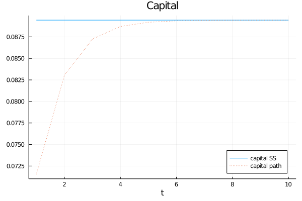
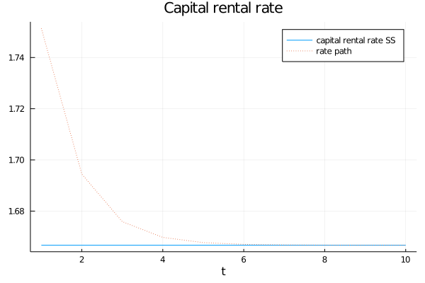
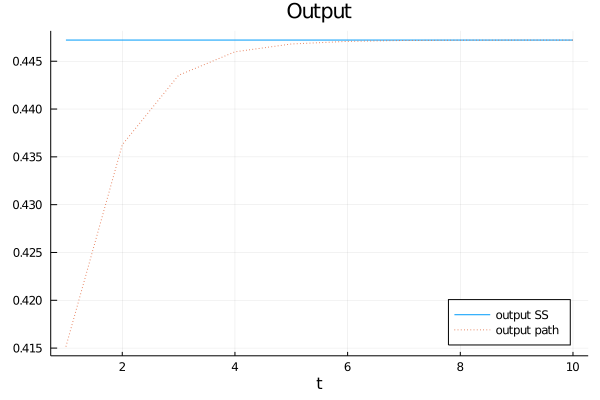
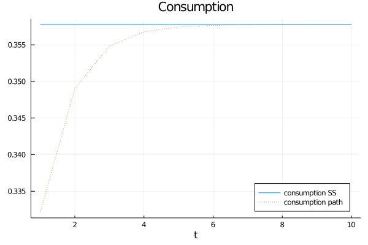

```{r setup, include=FALSE, cache=TRUE}
knitr::opts_chunk$set(echo = TRUE)
knitr::opts_chunk$set(engine.path = list(
  julia = '/Applications/Julia-1.5.app/Contents/Resources/julia/bin'
))
```
```{r julia, eval =FALSE, include=FALSE}
library(JuliaCall)
julia_home<-julia_setup(JULIA_HOME = "/Applications/Julia-1.5.app/Contents/Resources/julia/bin")
```

```{=latex}
		\subsection{Competitive equilibrium}
			\indent Arrow-Debreu competitive equilibrium consists of prices $\{p_t,w_t,r_t\}_{t=0}^{\infty}$, allocations for the firm $\{y_t,k_t^d,l_t^d\}_{t=0}^{\infty}$ and the allocations for household $\{c_t,k_t^s,l_t^s\}_{t=0}^{\infty}$ such that,
			\begin{itemize}
			\item[(i)] Given a sequence of prices $\{p_t,w_t,r_t\}_{t=0}^{\infty}$, the firm allocation $\{y_t,k_t^d,l_t^d\}_{t=0}^{\infty}$ solves the firm problem,
			\begin{equation}
			\begin{split}
				\max_{\{y_t,k_t,l_t\}_{t=0}^{\infty}}&\sum_{t=0}^{\infty}
				p_t(y_t-r_tk_t-w_tl_t)\\
				\text{s.t.  }&y_t=zk_t^{\alpha}l_t^{1-\alpha}, \forall t\geq 0;\\
				&y_t,k_t,l_t\geq 0, \forall t \geq 0.
			\end{split}
			\end{equation}
			
			\item[(ii)] Given a sequence of prices $\{p_t,w_t,r_t\}_{t=0}^{\infty}$, the household allocation $\{c_t,k_t^s,l_t^s\}_{t=0}^{\infty}$ solves the household problem,
			\begin{equation}
			\begin{split}
				\max_{\{c_t,k_{t+1},l_t\}_{t=0}^{\infty}}&\sum_{t=0}^{\infty}
				\beta ^t(\frac{c_t^{1-\sigma}}{1-\sigma}-\chi \frac{l_t^{1+\eta}}{1+\eta})\\
				\text{s.t.  }& \sum_{t=0}^{\infty}p_t(c_t+K_{t+1}-(1-\delta)k_t)
				\leq\sum_{t=0}^{\infty}p_t(r_tk_t+w_tl_t);\\
				&0\leq l_t\leq 1,0\leq k_t\leq k_0, c_t\geq 0, k_{t+1}\geq 0,\forall t \geq 0;\\
				&k_0 \text{ given.}
			\end{split}
			\end{equation}
			
			\item[(iii)] The market clear conditions,
			\begin{equation*}
			\begin{split}
				zk_t^{\alpha}l_t^{1-\alpha}+(1-\delta)k_t&=c_t+k_{t+1} ;\\
				l_t^d&=l_t^s	;\\
				k_t^d&=k_t^s 	.
			\end{split}
			\end{equation*}
			\end{itemize}
		
		\subsection{Steady state}
			For firm problem,
			\begin{equation}
			\begin{split}
				r_t =&z\alpha k_t^{\alpha -1}l_t^{1-\alpha}\\
				w_t =&z(1-\alpha) k_t^{\alpha}l_t^{-\alpha}\\
				r_tk_t+w_tl_t&=zk_t^{\alpha}l_t^{1-\alpha}
			\end{split}
			\end{equation}
			
			Then for household problem,
			\begin{equation}
			\begin{split}
				\mathcal{L}(\{c_t,k_{t+1},l_t\}_{t=0}^{\infty};\lambda_t)=&\sum_{t=0}^{\infty}
				\beta ^t(\frac{c_t^{1-\sigma}}{1-\sigma}-\chi \frac{l_t^{1+\eta}}{1+\eta})+\lambda_t(\sum_{t=0}^{\infty}p_t(zk_t^{\alpha}l_t^{1-\alpha}-c_t-k_{t+1}+(1-\delta)k_t)\\
				\frac{\partial \mathcal{L}}{\partial c_t}=&\beta^tc_t^{-\sigma}-\lambda_t p_t=0,\\
				\frac{\partial \mathcal{L}}{\partial l_t}=&-\beta^t\chi l_t^{\eta}+\lambda_t p_tz(1-\alpha) k_t^{\alpha}l_t^{-\alpha}=0,\\
				\frac{\partial \mathcal{L}}{\partial k_t}=&\lambda_t p_t(z\alpha k_t^{\alpha -1}l_t^{1-\alpha}+1-\delta)-\lambda_{t-1}p_{t-1}=0,\\
				c_t=&zk_t^{\alpha}l_t^{1-\alpha}-k_{t+1}+(1-\delta)k_t
			\end{split}
			\end{equation}
			For Steady state, $p_0=1$,
			then, 
			\begin{equation}\label{ssfoc}
			\begin{split}
				&c^{\sigma} l^{\eta}=
				z(1-\alpha)k^{\alpha}l^{-\alpha}/\chi\\
				&z\alpha k^{\alpha -1}l^{1-\alpha}=
				1/\beta -1 +\delta\\
				&c=zk^{\alpha}l^{1-\alpha}-\delta k
			\end{split}
			\end{equation}	

			\begin{equation*}
				M=\frac{k}{l}=\left(\frac{z\alpha \beta}{1-\beta +\beta \delta}\right)^{\frac{1}{1-\alpha}},
			\end{equation*}

			\begin{equation*}
				N=\frac{c}{l}=z(\frac{k}{l})^{\alpha}-\delta \frac{k}{l}=zM^{\alpha}-\delta M,
			\end{equation*}

			\begin{equation*}
			\begin{split}
				(lN)^{\sigma}l^{\eta}=&
				z(1-\alpha)(\frac{k}{l})^{\alpha}/\chi\Rightarrow\\
				l^{\sigma+\eta}&=\frac{z(1-\alpha)M^{\alpha}}{\chi N^{\sigma}} \Rightarrow\\
				l_{ss}=&\left(\frac{z(1-\alpha)M^{\alpha}}{\chi N^{\sigma}}\right)^{\frac{1}{\sigma+\eta}},
			\end{split}
			\end{equation*}
			Then,
			\begin{equation*}
			\begin{split}
				k_{ss}=&Ml\\
				c_{ss}=&Nl\\
				y_{ss}=&zk^{\alpha}l^{1-\alpha}=zM^{\alpha}l\\
				r_{ss}=&\alpha zk^{\alpha-1}l^{1-\alpha}=\alpha zM^{\alpha -1}\\
				w_{ss}=&(1-\alpha)zk^{\alpha}l^{\alpha}=(1-\alpha)zM^{\alpha}.
			\end{split}
			\end{equation*}
		\subsection{Social planner problem}
			The problem of the social planner is that, given the initial capital $k_0$,
			\begin{equation}\label{SPP1}
				\begin{split}
					w( k_0)&=\max_{\{c_t, k_t, l_t \}_{t=0}^{\infty}}
					\sum_{t=0}^{\infty}
					\beta ^t(\frac{c_t^{1-\sigma}}{1-\sigma}-\chi \frac{l_t^{1+\eta}}{1+\eta})\\
					s.t. \;\;zk_t^{\alpha}l_t^{1-\alpha}&=c_t+k_{t+1}-(1-\delta)k_t, \;\;\forall t\geq 0\\
					c_t&\geq0,\;k_t\geq0,\;0\leq l_t\leq 1,  \;\;\forall t\geq 0\\
					k_0&\text{ is given.}
				\end{split}
			\end{equation}
			Bellman equation,
			\begin{equation}
				V(k)=\max_{\begin{smallmatrix}0\leq l\leq 1
					\\0\leq k'\leq zk^{\alpha}l^{1-\alpha}+(1-\delta)k\end{smallmatrix}}
					\{\frac{(zk^{\alpha}l^{1-\alpha}+(1-\delta)k-k')^{1-\sigma}}{1-\sigma}-\chi \frac{l^{1+\eta}}{1+\eta}+\beta \mathbb{E}V(k')\}
			\end{equation}

```


### VFI

```{julia, eval=FALSE}
# Julia code
# defining parameters

# Paramters
    # Generate structure for parameters using Parameters module
    # We can set default values for our parameters
    @with_kw struct Par
        # Model Parameters
        z::Float64 = 1    ; # Productivity
        α::Float64 = 1/3  ; # Production function
        β::Float64 = 0.98 ; # Discount factor
        σ::Float64 = 2
        η::Float64 = 1
        δ::Float64 = 1
        χ::Float64
        l::Float64
        M = ((z*α*β)/(1-β+β*δ))^(1/(1-α))
        N = z*M^(α)-δ*M
        # VFI Paramters
        max_iter::Int64   = 2000  ; # Maximum number of iterations
        dist_tol::Float64 = 1E-9  ; # Tolerance for distance
        # Howard's Policy Iterations
        H_tol::Float64    = 1E-9  ; # Tolerance for policy function iteration
    end

    # Allocate paramters to object p for future calling

    p = Par(l= 0.4, χ =1.0)

# Getting the right χ
function get_me_chi(l,p::Par)
    @unpack z, α, β, M, N, σ, η = p
    f(x) = x*(N^σ)*(l^(σ+η))-(z*(1-α)*M^α)
    chi = find_zero(f, 1E-9)
    return chi
end

chi = get_me_chi(0.4,p)

p = Par(l= 0.4, χ=40.2)

# Getting the right χ

using IntervalArithmetic, IntervalRootFinding

function get_me_l(k,kp,p::Par)
    @unpack z, α, β, M, N, σ, η, χ = p
    f(l) = z*(1-α)*(k^α)/((z*(k^α)*(l^(1-α))-kp)^σ)-χ*(l^(η+α))
    A = range(0,1;length=100)
    B = f.(A)
    l = minimum(B[B.>=0])
end

get_me_l(k_grid_20[1],k_grid_20[G_kp_20][1],p)


# Steady state values (funciton)
function SS_values(p::Par)
    # This function takes in parameters and provides steady state values
    # Parameters: productivity (z), returns to scale (a) and discount factor (b)
    # Output: values for capital, production, consumption, rental rate, wage
    @unpack z, α, β, M, N, l = p
    l_ss = l
    k_ss = M*l_ss
    c_ss = N*l_ss
    y_ss = z*l_ss*M^α
    r_ss = α*z*M^(α-1)
    w_ss = (1-α)*z*M^α
    return l_ss,k_ss,y_ss,c_ss,r_ss,w_ss
end

# Test steady state function
l_ss,k_ss,y_ss,c_ss,r_ss,w_ss = SS_values(p)
println(" ")
println("------------------------")
println(" Steady State variables")
println("   Quantities: l = $l_ss; k = $k_ss; y = $y_ss; c = $c_ss;")
println("   Prices:     r = $r_ss; w = $w_ss;")
println("------------------------")
println(" ")


# Steady state values (funciton)
function path(k,kp,l,p::Par)
    # This function takes in parameters and provides steady state values
    # Parameters: productivity (z), returns to scale (a) and discount factor (b)
    # Output: values for capital, production, consumption, rental rate, wage
    @unpack z, α, β, M, N, l = p
    w = (a,b) -> (1-α)*(a^α)*(b^(-α))
    r = (a,b) -> α*(a^(a-1))*(b^(1-α))
    y = (a,b) -> (a^α)*b^(1-α)
    c = (a,b,d) -> y(a,b)-d
    l = get_me_l.(k,k_p,fill(p,length(k)))
    wage = w.(k,l)
    int = r.(k,l)
    cons = c.(k,kp,l)
    output = y.(k,l)
    labor = l
    return wage, int, cons, labor, output
end

# Utility function
function utility(k,kp,l,p::Par)
    @unpack z, α, χ, η, σ = p
    y = (a,b) -> (a^α)*b^(1-α)
    c = (a,b,d) -> y(a,b)-d
    utils = (c(k,l,kp).^(1-σ))/(1-σ)-(χ*l.^(η+1)/(η+1))
    return utils
end


# VFI with Grid
    # Grid
    function Make_K_Grid(n_k,p::Par)
        # Get SS
        l_ss,k_ss,y_ss,c_ss,r_ss,w_ss = SS_values(p)
        # Get k_grid
        k_grid = range(1E-5,2*k_ss;length=n_k) ; # Equally spaced grid between 0 and 2*k_ss
        # Return
        return k_grid
    end

    # Solve VFI with grid search and loops
    function VFI_grid(T::Function,k_grid,p::Par)
        # VFI paramters
        @unpack max_iter, dist_tol = p
        # Initialize variables for loop
        n_k    = length(k_grid) ; # Number of grid nodes
        V_old  = zeros(n_k)     ; # Initial value, a vector of zeros
        V_dist = 1              ; # Initialize distance
        println(" ")
        println("------------------------")
        println("VFI - Grid Search - n_k=$n_k")
        for iter=1:max_iter
            # Update value function
            V_new, G_kp, G_l = T(V_old)
            # Update distance and iterations
            V_dist = maximum(abs.(V_new./V_old.-1))
            iter  += 1
            # Update old function
            V_old  = V_new
            # Report progress
            if mod(iter,100)==0
                println("   VFI Loop: iter=$iter, dist=",100*V_dist,"%")
            end
            # Check convergence and return results
            if V_dist<=dist_tol
                println("VFI - Grid Search - n_k=$n_k")
                println("Iterations = $iter and Distance = ",100*V_dist,"%")
                println("------------------------")
                println(" ")
                return V_new, G_kp, G_l
            end
        end
        # If loop ends there was no convergence -> Error!
        error("Error in VFI - Grid Search - Solution not found")
    end

#-----------------------------------------------------------
#-----------------------------------------------------------
# VFI - Grid Search - Loops


# Define function for Value update and policy functions
    function T_grid_loop(V_old,k_grid,p::Par)
        @unpack z, α, β = p
        n_k  = length(k_grid)
        V    = zeros(n_k)
        G_kp = fill(0,n_k)
        G_l = fill(0.0,n_k)
        for i = 1:n_k
            V_aux = zeros(n_k) ; # Empty vector for auxiliary value of V(i,j)
            G_l_aux = zeros(n_k)
            for j = 1:n_k
                # Evaluate potential value function for combinations of
                # current capital k_i and future capital k_j
                G_l_aux[j] = get_me_l(k_grid[i],k_grid[j],p)
                V_aux[j] = utility(k_grid[i],k_grid[j],G_l_aux[j],p) + β*V_old[j]
                #println(V_aux[j]," ",k_grid[i]," ",k_grid[j]," ",utility(k_grid[i],k_grid[j],z,a,b) + b*V_old[j])
            end
            # Choose maximum value given current capital k_i
            V[i], G_kp[i] = findmax(V_aux)
            G_l[i] = G_l_aux[G_kp[i]]
        end
        return V, G_kp, G_l
    end


# Solve VFI with grid search and loops
    function Solve_VFI_loop(n_k,p::Par)
        # Get Grid
        k_grid = Make_K_Grid(n_k,p)
        # Solve VFI
        V, G_kp, G_l = VFI_grid(x->T_grid_loop(x,k_grid,p),k_grid,p)
        # Return Solution
        return V,G_kp, G_l, k_grid
    end

    # Execute Numerical VFI
    @time V_20, G_kp_20, G_l_20, k_grid_20 = Solve_VFI_loop(20,p)
    @time V_50, G_kp_50, G_l_50, k_grid_50 = Solve_VFI_loop(50,p)
    @time V_200, G_kp_200, G_l_200,k_grid_200 = Solve_VFI_loop(200,p)
    @time V_1000, G_kp_1000, G_l_1000, k_grid_1000 = Solve_VFI_loop(1000,p)

    gr()
    # Value Function Analytical vs 200
        plot(k_grid_20,V_20,linetype=:scatter,marker=(:diamond,3), msw=0 , label="VFI - n_k=50")
        plot!(k_grid_50,V_50,linetype=:scatter,marker=(:diamond,3),msw=0 , label = "VFI - n_k=20")
        plot!(k_grid_200,V_200,linetype=:scatter,marker=(:diamond,3),msw=0 , label = "VFI - n_k=200")
        plot!(k_grid_1000,V_1000,linetype=:scatter,marker=(:diamond,3),msw=0 , label = "VFI - n_k=1000")
        xlabel!("Capital")
        ylabel!("Value")
        title!("Value Fn VFI")
        savefig("graphs/VFI_V")


    # Capital Policy Function Analytical vs 200
        plot(k_grid_200,k_grid_200,lw=1,linecolor=RGB(0.6,0.6,0.6),label=nothing)
        plot!(k_grid_50,k_grid_50[G_kp_50],linetype=:scatter,marker=(:diamond,3),msw=0 ,label="VFI - n_k=50")
        plot!(k_grid_20,k_grid_20[G_kp_20],linetype=:scatter,marker=(:diamond,3),msw=0 ,label = "VFI - n_k=20")
        plot!(k_grid_200,k_grid_200[G_kp_200],linetype=:scatter,marker=(:diamond,3),msw=0 ,label = "VFI - n_k=200")
        plot!(k_grid_1000,k_grid_1000[G_kp_1000],linetype=:scatter,marker=(:diamond,3),msw=0 ,label = "VFI - n_k=1000")
        xlabel!("Capital")
        ylabel!("Capital")
        title!("Capital VFI")
        savefig("graphs/VFI_cap")


    # Euler Equation
    function Euler_Error(k,kp,kpp,p::Par)
        # Return percentage error in Euler equation
        @unpack z, α, β, σ, l = p
        lp = l
        LHS = ((z*kp^α*lp^(1-α)-kpp)/(z*k^α*l^(1-α)-kp))^σ
        RHS = β*α*z*kp^(α-1)*lp^(1-α)
        return (RHS/LHS-1)*100
    end

    # Euler error by number of points in grid
    function Euler_grid(k_grid::AbstractArray,G_kp::AbstractArray)
        # Euler error of numerical policy function on grid
        n_k = length(k_grid)
        Euler = zeros(n_k)
        for i=1:n_k
            k   = k_grid[i]
            kp  = k_grid[G_kp[i]]
            kpp = k_grid[G_kp[G_kp[i]]]
            Euler[i] = Euler_Error(k,kp,kpp,p)
        end
        # Return
        return Euler
    end

    Euler_20 = Euler_grid(k_grid_20,G_kp_20)
    Euler_50 = Euler_grid(k_grid_50,G_kp_50)
    Euler_200 = Euler_grid(k_grid_200,G_kp_200)
    Euler_1000 = Euler_grid(k_grid_1000,G_kp_1000)

    # Graphing Euler Error 200
    plot([0,2*k_ss],[0,0],lw=1,linecolor=RGB(0.6,0.6,0.6),label=nothing,title = "Euler Equation Error (%)")
    plot!(k_grid_50,Euler_50,linetype=:scatter,marker=(:diamond,3),msw=0 ,label="VFI - n_k=50")
    plot!(k_grid_20,Euler_20,linetype=:scatter,marker=(:diamond,3),msw=0 ,label="VFI - n_k=20")
    plot!(k_grid_20,Euler_200,linetype=:scatter,marker=(:diamond,3),msw=0 ,label="VFI - n_k=200")
    plot!(k_grid_20,Euler_1000,linetype=:scatter,marker=(:diamond,3),msw=0 ,label="VFI - n_k=1000")
    xlabel!("Capital")
    ylabel!("Percentage Points")
    title!("Euler Error VFI")
    savefig("graphs/VFI_Euler")

#-----------------------------------------------------------
    # VFI - Grid Search - Matrices - Howard's Policy Iteration

    # Define function for Value update and policy functions
        function HT_grid_mat(V_old,U_mat,k_grid,p::Par,n_H)
            @unpack z, α, β, H_tol = p
            # Get Policy Function
            n_k    = length(V_old)
            V,G_kp = findmax( U_mat .+ β*repeat(V_old',n_k,1) , dims=2 )
            V_old  = V
            # "Optimal" U for Howard's iteration
                U_vec = U_mat[G_kp]
            # Howard's policy iteration
            # G_kp is a Cartesian Index
            for i=1:n_H
                V = U_vec .+ β*repeat(V_old',n_k,1)[G_kp]
                if maximum(abs.(V./V_old.-1))<=H_tol
                    break
                end
                V_old = V
            end
            # Recover Policy Functions
            G_kp   = [G_kp[i][2] for i in 1:n_k] # G_kp is a Cartesian index
            # Return output
            return V, G_kp
        end


    # Solve VFI with Howard's policy iteration
        function Solve_VFI_HPI(n_H,n_k,p::Par)
            # Get Grid
            k_grid = Make_K_Grid(n_k,p)
            # Utility matrix
            U_mat = [utility(k_grid[i],k_grid[j],get_me_l(k_grid[i],k_grid[j],p),p) for i in 1:n_k, j in 1:n_k]
            # Solve VFI
            V, G_kp = VFI_grid(x->HT_grid_mat(x,U_mat,k_grid,p,n_H),k_grid,p)
            # Return Solution
            return V,G_kp, k_grid
        end

        # Execute Numerical VFI
        @time V_20, G_kp_20, k_grid_20 = Solve_VFI_HPI(20,20,p)
        @time V_50, G_kp_50, k_grid_50 = Solve_VFI_HPI(20,50,p)
        @time V_200, G_kp_200, k_grid_200 = Solve_VFI_HPI(20,200,p)
        @time V_1000, G_kp_1000, k_grid_1000 = Solve_VFI_HPI(20,1000,p)

        # Value Function Plot
            plot(k_grid_20,V_20,linetype=:scatter,marker=(:diamond,3), msw=0 , label="VFI - n_k=50")
            plot!(k_grid_50,V_50,linetype=:scatter,marker=(:diamond,3),msw=0 , label = "VFI - n_k=20")
            plot!(k_grid_200,V_200,linetype=:scatter,marker=(:diamond,3),msw=0 , label = "VFI - n_k=200")
            plot!(k_grid_1000,V_1000,linetype=:scatter,marker=(:diamond,3),msw=0 , label = "VFI - n_k=1000")
            xlabel!("Capital")
            ylabel!("Value")
            title!("Value Function VFI-HPI")
            savefig("graphs/HPI_V")


        # Capital Policy Function
            plot(k_grid_200,k_grid_200,lw=1,linecolor=RGB(0.6,0.6,0.6),label=nothing)
            plot!(k_grid_50,k_grid_50[G_kp_50],linetype=:scatter,marker=(:diamond,3),msw=0 ,label="VFI - n_k=50")
            plot!(k_grid_20,k_grid_20[G_kp_20],linetype=:scatter,marker=(:diamond,3),msw=0 ,label = "VFI - n_k=20")
            plot!(k_grid_200,k_grid_200[G_kp_200],linetype=:scatter,marker=(:diamond,3),msw=0 ,label = "VFI - n_k=200")
            plot!(k_grid_1000,k_grid_1000[G_kp_1000],linetype=:scatter,marker=(:diamond,3),msw=0 ,label = "VFI - n_k=1000")
            xlabel!("Capital")
            ylabel!("Capital")
            title!("Capital VFI-HPI")
            savefig("graphs/HPI_Cap")

            Euler_20 = Euler_grid(k_grid_20,G_kp_20)
            Euler_50 = Euler_grid(k_grid_50,G_kp_50)
            Euler_200 = Euler_grid(k_grid_200,G_kp_200)
            Euler_1000 = Euler_grid(k_grid_1000,G_kp_1000)

            # Graphing Euler Error 200
            plot([0,2*k_ss],[0,0],lw=1,linecolor=RGB(0.6,0.6,0.6),label=nothing,title = "Euler Equation Error (%)")
            plot!(k_grid_50,Euler_50,linetype=:scatter,marker=(:diamond,3),msw=0 ,label="VFI - n_k=50")
            plot!(k_grid_20,Euler_20,linetype=:scatter,marker=(:diamond,3),msw=0 ,label="VFI - n_k=20")
            plot!(k_grid_20,Euler_200,linetype=:scatter,marker=(:diamond,3),msw=0 ,label="VFI - n_k=200")
            plot!(k_grid_20,Euler_1000,linetype=:scatter,marker=(:diamond,3),msw=0 ,label="VFI - n_k=1000")
            xlabel!("Capital")
            ylabel!("Percentage Points")
            title!("Euler Error VFI-HPI")
            savefig("graphs/HPI_Euler")

```


```{r, out.width='70%',fig.align='center', fig.cap='Wage and capital', echo=FALSE, fig.show='hold', fig.path = '../graphs/'}


```

```{r, out.width='70%', fig.align='center', fig.cap='Capital rate and output', echo=FALSE, fig.show='hold', fig.path = '../graphs/'}


```

```{r, out.width='70%', fig.align='center', fig.cap='Consumption', echo=FALSE, eval=TRUE, , fig.show='hold', fig.path = '../graphs/'}

```

