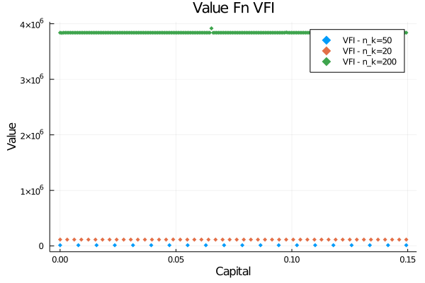
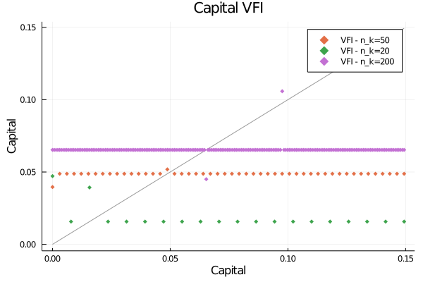
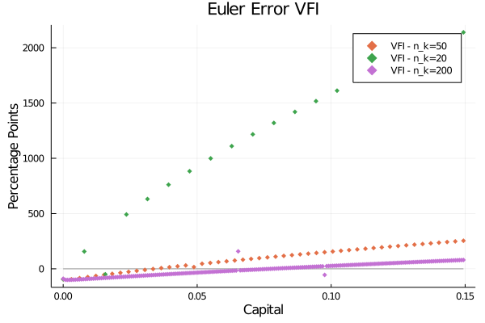
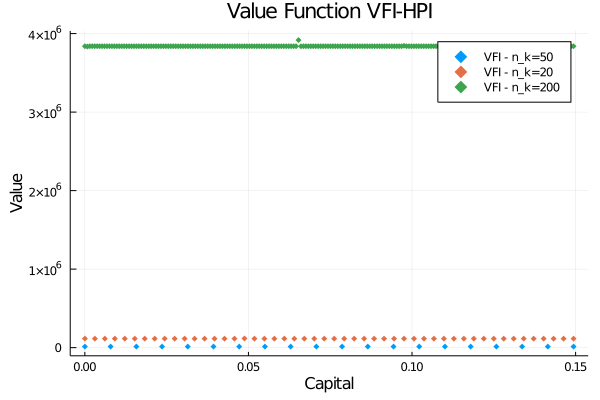
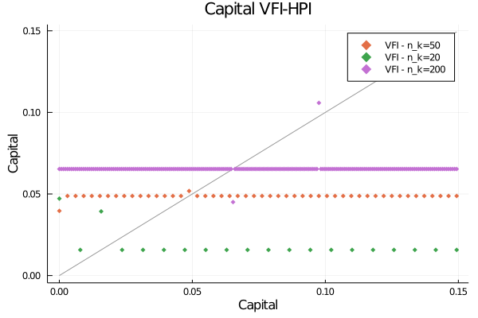
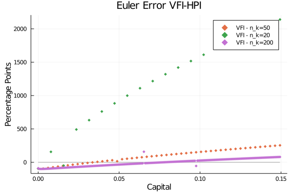

```{r setup, include=FALSE, cache=TRUE}
knitr::opts_chunk$set(echo = TRUE)
knitr::opts_chunk$set(engine.path = list(
  julia = '/Applications/Julia-1.5.app/Contents/Resources/julia/bin'
))
```
```{r julia, eval =FALSE, include=FALSE}
library(JuliaCall)
julia_home<-julia_setup(JULIA_HOME = "/Applications/Julia-1.5.app/Contents/Resources/julia/bin")
```

```{=latex}
		\subsection{Competitive equilibrium}
			\indent Arrow-Debreu competitive equilibrium consists of prices $\{p_t,w_t,r_t\}_{t=0}^{\infty}$, allocations for the firm $\{y_t,k_t^d,l_t^d\}_{t=0}^{\infty}$ and the allocations for household $\{c_t,k_t^s,l_t^s\}_{t=0}^{\infty}$ such that,
			\begin{itemize}
			\item[(i)] Given a sequence of prices $\{p_t,w_t,r_t\}_{t=0}^{\infty}$, the firm allocation $\{y_t,k_t^d,l_t^d\}_{t=0}^{\infty}$ solves the firm problem,
			\begin{equation}
			\begin{split}
				\max_{\{y_t,k_t,l_t\}_{t=0}^{\infty}}&\sum_{t=0}^{\infty}
				p_t(y_t-r_tk_t-w_tl_t)\\
				\text{s.t.  }&y_t=zk_t^{\alpha}l_t^{1-\alpha}, \forall t\geq 0;\\
				&y_t,k_t,l_t\geq 0, \forall t \geq 0.
			\end{split}
			\end{equation}
			
			\item[(ii)] Given a sequence of prices $\{p_t,w_t,r_t\}_{t=0}^{\infty}$, the household allocation $\{c_t,k_t^s,l_t^s\}_{t=0}^{\infty}$ solves the household problem,
			\begin{equation}
			\begin{split}
				\max_{\{c_t,k_{t+1},l_t\}_{t=0}^{\infty}}&\sum_{t=0}^{\infty}
				\beta ^t(\frac{c_t^{1-\sigma}}{1-\sigma}-\chi \frac{l_t^{1+\eta}}{1+\eta})\\
				\text{s.t.  }& \sum_{t=0}^{\infty}p_t(c_t+K_{t+1}-(1-\delta)k_t)
				\leq\sum_{t=0}^{\infty}p_t(r_tk_t+w_tl_t);\\
				&0\leq l_t\leq 1,0\leq k_t\leq k_0, c_t\geq 0, k_{t+1}\geq 0,\forall t \geq 0;\\
				&k_0 \text{ given.}
			\end{split}
			\end{equation}
			
			\item[(iii)] The market clear conditions,
			\begin{equation*}
			\begin{split}
				zk_t^{\alpha}l_t^{1-\alpha}+(1-\delta)k_t&=c_t+k_{t+1} ;\\
				l_t^d&=l_t^s	;\\
				k_t^d&=k_t^s 	.
			\end{split}
			\end{equation*}
			\end{itemize}
		
		\subsection{Steady state}
			For firm problem,
			\begin{equation}
			\begin{split}
				r_t =&z\alpha k_t^{\alpha -1}l_t^{1-\alpha}\\
				w_t =&z(1-\alpha) k_t^{\alpha}l_t^{-\alpha}\\
				r_tk_t+w_tl_t&=zk_t^{\alpha}l_t^{1-\alpha}
			\end{split}
			\end{equation}
			
			Then for household problem,
			\begin{equation}
			\begin{split}
				\mathcal{L}(\{c_t,k_{t+1},l_t\}_{t=0}^{\infty};\lambda_t)=&\sum_{t=0}^{\infty}
				\beta ^t(\frac{c_t^{1-\sigma}}{1-\sigma}-\chi \frac{l_t^{1+\eta}}{1+\eta})+\lambda_t(\sum_{t=0}^{\infty}p_t(zk_t^{\alpha}l_t^{1-\alpha}-c_t-k_{t+1}+(1-\delta)k_t)\\
				\frac{\partial \mathcal{L}}{\partial c_t}=&\beta^tc_t^{-\sigma}-\lambda_t p_t=0,\\
				\frac{\partial \mathcal{L}}{\partial l_t}=&-\beta^t\chi l_t^{\eta}+\lambda_t p_tz(1-\alpha) k_t^{\alpha}l_t^{-\alpha}=0,\\
				\frac{\partial \mathcal{L}}{\partial k_t}=&\lambda_t p_t(z\alpha k_t^{\alpha -1}l_t^{1-\alpha}+1-\delta)-\lambda_{t-1}p_{t-1}=0,\\
				c_t=&zk_t^{\alpha}l_t^{1-\alpha}-k_{t+1}+(1-\delta)k_t
			\end{split}
			\end{equation}
			For Steady state, $p_0=1$,
			then, 
			\begin{equation}\label{ssfoc}
			\begin{split}
				&c^{\sigma} l^{\eta}=
				z(1-\alpha)k^{\alpha}l^{-\alpha}/\chi\\
				&z\alpha k^{\alpha -1}l^{1-\alpha}=
				1/\beta -1 +\delta\\
				&c=zk^{\alpha}l^{1-\alpha}-\delta k
			\end{split}
			\end{equation}	

			\begin{equation*}
				M=\frac{k}{l}=\left(\frac{z\alpha \beta}{1-\beta +\beta \delta}\right)^{\frac{1}{1-\alpha}},
			\end{equation*}

			\begin{equation*}
				N=\frac{c}{l}=z(\frac{k}{l})^{\alpha}-\delta \frac{k}{l}=zM^{\alpha}-\delta M,
			\end{equation*}

			\begin{equation*}
			\begin{split}
				(lN)^{\sigma}l^{\eta}=&
				z(1-\alpha)(\frac{k}{l})^{\alpha}/\chi\Rightarrow\\
				l^{\sigma+\eta}&=\frac{z(1-\alpha)M^{\alpha}}{\chi N^{\sigma}} \Rightarrow\\
				l_{ss}=&\left(\frac{z(1-\alpha)M^{\alpha}}{\chi N^{\sigma}}\right)^{\frac{1}{\sigma+\eta}},
			\end{split}
			\end{equation*}
			Then,
			\begin{equation*}
			\begin{split}
				k_{ss}=&Ml\\
				c_{ss}=&Nl\\
				y_{ss}=&zk^{\alpha}l^{1-\alpha}=zM^{\alpha}l\\
				r_{ss}=&\alpha zk^{\alpha-1}l^{1-\alpha}=\alpha zM^{\alpha -1}\\
				w_{ss}=&(1-\alpha)zk^{\alpha}l^{\alpha}=(1-\alpha)zM^{\alpha}.
			\end{split}
			\end{equation*}
		\subsection{Social planner problem}
			The problem of the social planner is that, given the initial capital $k_0$,
			\begin{equation}\label{SPP1}
				\begin{split}
					w( k_0)&=\max_{\{c_t, k_t, l_t \}_{t=0}^{\infty}}
					\sum_{t=0}^{\infty}
					\beta ^t(\frac{c_t^{1-\sigma}}{1-\sigma}-\chi \frac{l_t^{1+\eta}}{1+\eta})\\
					s.t. \;\;zk_t^{\alpha}l_t^{1-\alpha}&=c_t+k_{t+1}-(1-\delta)k_t, \;\;\forall t\geq 0\\
					c_t&\geq0,\;k_t\geq0,\;0\leq l_t\leq 1,  \;\;\forall t\geq 0\\
					k_0&\text{ is given.}
				\end{split}
			\end{equation}
			Bellman equation,
			\begin{equation}
				V(k)=\max_{\begin{smallmatrix}0\leq l\leq 1
					\\0\leq k'\leq zk^{\alpha}l^{1-\alpha}+(1-\delta)k\end{smallmatrix}}
					\{\frac{(zk^{\alpha}l^{1-\alpha}+(1-\delta)k-k')^{1-\sigma}}{1-\sigma}-\chi \frac{l^{1+\eta}}{1+\eta}+\beta \mathbb{E}V(k')\}
			\end{equation}

```


### VFI

[Julia code: click here.](https://github.com/hans-mtz/AdvMacro/blob/master/A2.jl)

```{julia, eval=FALSE}
# Julia code
# See A2.jl

```


```{r, out.width='65%',fig.align='center', fig.cap='Plain VFI', echo=FALSE, fig.show='hold', fig.path = '../graphs/'}



```

```{r, out.width='65%',fig.align='center', fig.cap='HPI-VFI', echo=FALSE, fig.show='hold', fig.path = '../graphs/'}



```

